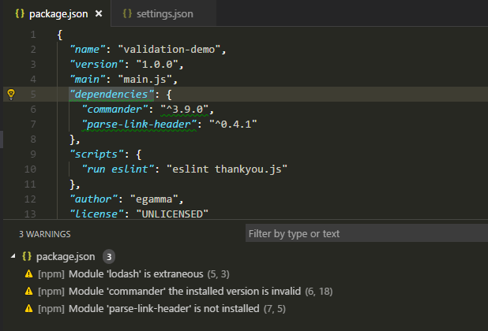
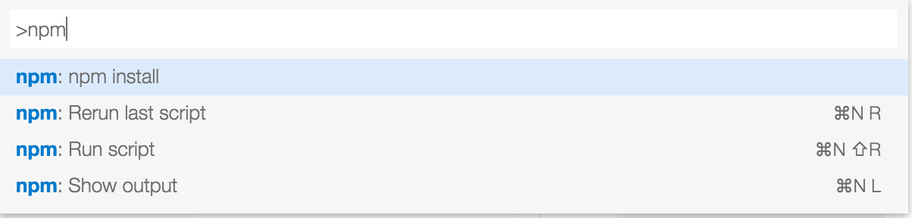

# Node npm xxx

This extension supports running npm scripts defined in the `package.json` file and validating the installed modules
against the dependencies defined in the `package.json`.

**Notice** The validation is done by running `npm` and it is not run when the modules are managed by `yarn`.

The `package.json` validation reports warnings for modules:

- that are defined in the package.json, but that are not installed
- that are installed but not defined in the package.json
- that are installed but do not satisfy the version defined in the package.json.

Quick fixes to run `npm` are provided for reported warnings.



Commands for running scripts are available the `npm` category.



- Run npm install, also available in the context menu of the explorer when the `package.json` file
- Run a script (`npm run-script`) defined in the `package.json` by picking a script
  defined in the `scripts` section of the `package.json`.
- Rerun the last npm script you have executed using this extension.
- Terminate a running script

The scripts can be run either in the integrated terminal or an output window.

Support for Macbook Pro touch bar. You can run the following commands:

- npm install
- npm start
- npm test
- npm build


## Settings

- `npm.validate.enable` validate the dependencies in the `package.json` file, the default is `true`.
- `npm.runInTerminal` defines whether the command is run
  in a terminal window or whether the output form the command is shown in the `Output` window. The default is to show the output in the terminal.
- `npm.includeDirectories` define additional directories that include a `package.json`.
- `npm.useRootDirectory` define whether the root directory of the workspace should be ignored, the default is `false`.
- `npm.runSilent` run npm commands with the `--silent` option, the default is `false`.
- `npm.bin` custom npm bin name, the default is `npm`.
- `npm.enableTouchbar` Enable the npm scripts on macOS touchbar.

##### Example

```javascript
{
	"npm.runInTerminal": false,
	"npm.includeDirectories": [
		"subdir1/path",
		"subdir2/path"
	]
}
```

## Keyboard Shortcuts

The extension defines a chording keyboard shortcut for the `R` key. As a consequence an existing keybinding for `R` is not executed immediately. If this is not desired, then please bind another key for these commands, see the [customization](https://code.visualstudio.com/docs/customization/keybindings) documentation.
